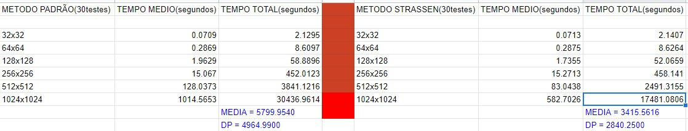
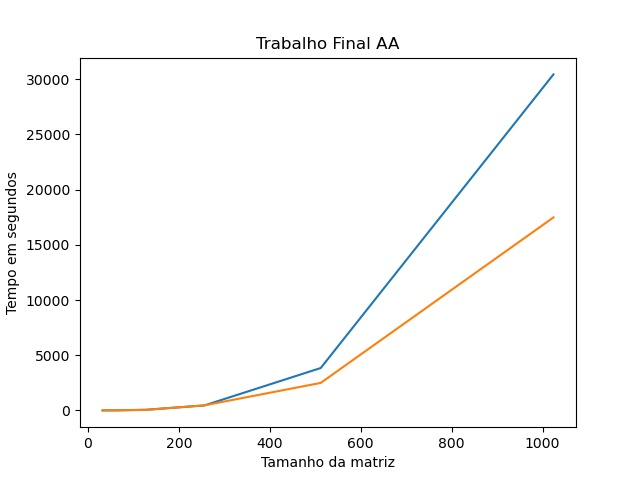

# trabalho-final-aa
Código do trabalho final do curso de Análise de Algoritmos da Universidade Federal de Uberlândia

1- 
Alunos: Victor Hugo Marra Araujo - 11721BCC041
Leonardo Ferreira Essia - 11721BCC009
Leonardo Frangello Franzese - 11721BCC029

2- 
a) A linguagem utilizada foi o Python na versão 3.8.1.
b) Foram criados 6 pares de matrizes de tamanhos(32x32,64x64,128x128,256x256,512x512 e 1024x1024) com números inteiros de 0 a 10000
c) Foram feitos 30 testes para cada tamanho das matrizes com os 2 algoritmos.

3-  

O algoritmo de Strassen na média total das execuções é 41.11% mais eficiente. Agora separadamente para matrizes de 32x32 o algoritmo padrão é 0.47% mais eficiente, matrizes de 64x64 o algoritmo padrão é 0.81% mais eficiente, matrizes de 128x128 o algoritmo de Strassen já toma a frente e é 11.59% mais eficiente na média das execuções, matrizes de 256x256 o Algoritmo padrão performou 1.36% melhor(aqui na teoria o algoritmo de Strassen deveria ter uma margem superior sobre o padrão mas foi pior, tudo indica que algo aconteceu na hora da execução que afetou a performance do algoritmo de Strassen), para matrizes de 512x512 o algoritmo de Strassen foi 35.14% mais eficiente e por fim em matrizes de 1024x1024 algoritmo de Strassen foi 42.57% mais eficiente.

Em azul a linha que representa o algoritmo padrão e em laranja a linha que representa o algoritmo de Strassen. Nota-se que em matrizes maiores de 500x500 o algoritmo de Strassen toma a frente com uma grande margem de desempenho.

Para efeito de medição os algoritmos foram executados em uma máquina com um processador Intel Core I58600k de 6 núcleos com Windows 10 e Python na versão 3.8.1.

